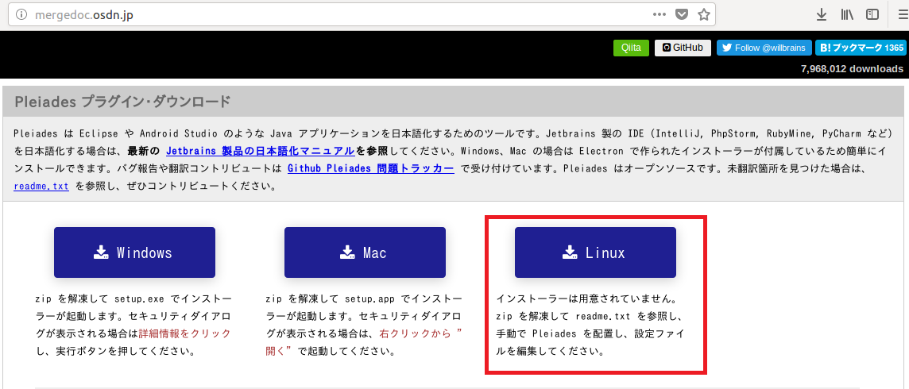
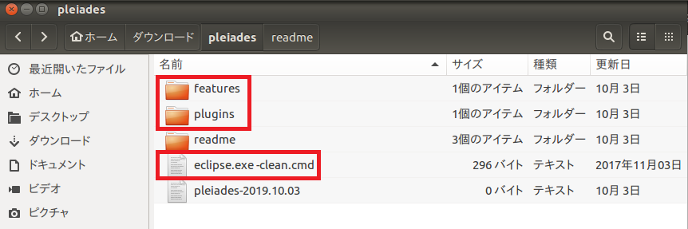
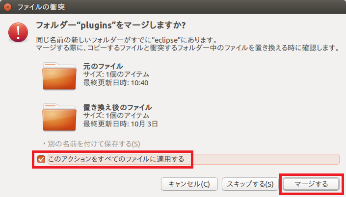
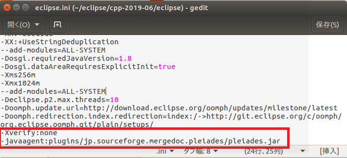

## 日本語化プラグイン「Pleiades」をインストールする

### 1. Mardocプロジェクトの[ダウンロードページ](http://mergedoc.osdn.jp/)より Pleiades プラグイン（pleiades.zip）をダウンロードする。
- pleiades.zipをダウンロードし、解凍する

 

### 2.「Pleiades」の設定ファイルを上書きコピーする
- 解凍した「Pleiades」フォルダー内の「plugins」と「features」フォルダーと「eclipse.exe -clean.cmd」ファイルを、インストールしたEclipseのホームフォルダーにコピーする
- この操作をすべてのファイルとフォルダーに適用するにチェックをいれ、マージするをクリックする

 

 

### 3. 「eclipse.ini」ファイルを編集する

-Eclipseのホームフォルダー内のeclipse.iniを編集する
-最終行に以下の２行を追加する

<pre>
-Xverify:none
-javaagent:plugins/jp.sourceforge.mergedoc.pleiades/pleiades.jar
</pre>

 

## コマンドライン
<pre>
$ wget http://ftp.jaist.ac.jp/pub/mergedoc/pleiades/build/stable/pleiades.zip
$ unzip pleiades.zip -d pleiades
$ cp -ru pleiades/*/ <eclipseの実行ファイルのあるディレクトリ>
$ cd <eclipseの実行ファイルのあるディレクトリ>
$ vim eclipse.ini
</pre>
