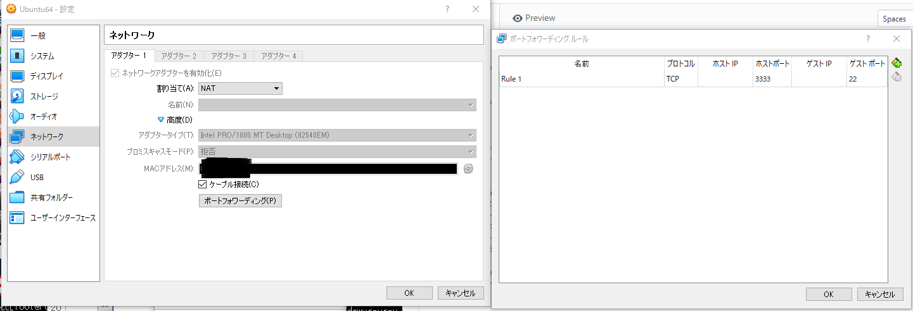

### 1. ssh インストール
<pre>
$ sudo apt-get install ssh
</pre>

※先に sudo apt-get update が必要かも？

### 2. ssh 自動起動設定＆起動
<pre>
$ sudo systemctl enable ssh
$ sudo systemctl start ssh
</pre>

### 3. VirtualBox ネットワーク設定
* デバイスタブ⇒ネットワーク⇒ネットワーク設定 
* ネットーワークをフォーカスしアダプター1タブで▷高度をクリック 
* ポートフォワーディングボタン押下 
* 右端の＋ボタンを押下 
* 名前カラムに適当な名前、ホストポートに3333、ゲストポートに22を設定 

### 4. Teratermで接続
* Teratermを実行し、ホスト(T)に「localhost:3333」、TCPポート(P)に「22」を設定し接続する

#### *
E: ロック /var/lib/dpkg/lock が取得できませんでした。 - open（11: リソースが一時的に利用できません） 
... 

上記が出た場合は下記コマンド実行
<pre>
$ sudo rm /var/lib/apt/lists/lock
$ sudo rm /var/lib/dpkg/lock

$ sudo apt-get update
</pre>

