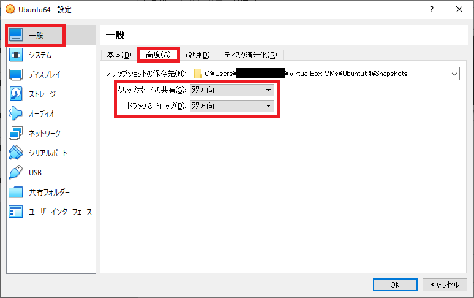
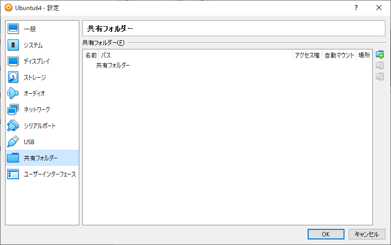
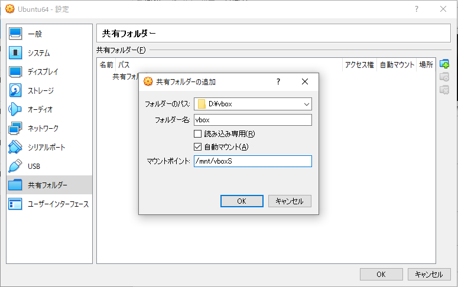
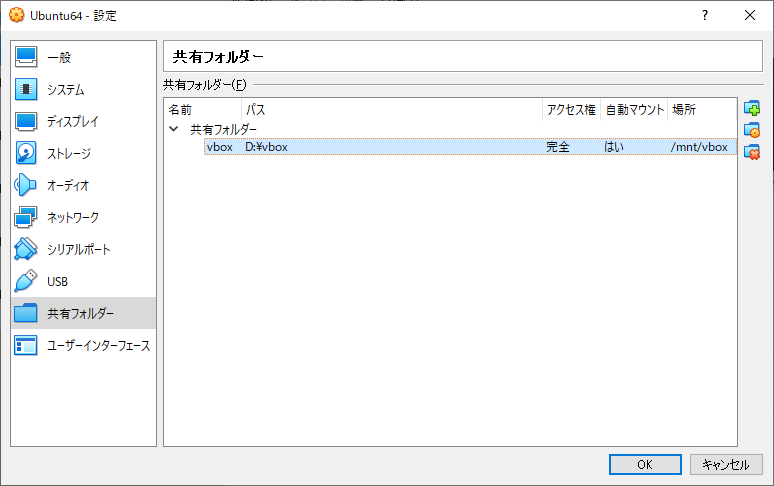

作成時ver 6.0.8 r130520(Qt5.6.2)  

## ホスト OS と ゲスト OS 間でのコピー&ペースト、ドラッグ＆ドロップの有効化を設定

- VirtualBox の画面で作成した仮想マシンを選択し、ツールバーの“設定(S)”をクリック
- 左ウィンドウの“一般”をクリックし、右ウィンドウの”高度(A)”タブを選択し、『クリップボードの共有(S)』の”双方向”を選択、同様に『ドラッグ＆ドロップ(D)』の”双方向”選択する

  

## 共有フォルダ設定

- あらかじめホストマシン側で共有用のフォルダを作成する
  本書では&lt;D:\vbox&gt;を作成している
- VirtualBox の画面で作成した仮想マシンを選択し、ツールバーの“設定(S)”をクリック
- 左ウィンドウの“共有フォルダー”をクリックし、右端上のアイコンをクリック

  

- 共有フォルダーの追加ダイアログの『フォルダーのパス』に作成したフォルダーを入力し、”自動マウント(A)”を選択し、マウントポイントにゲストOSのマウントポイントを設定

  

- 設定ダイアログで共有フォルダーが追加されていることを確認し”OK”をクリック

  
