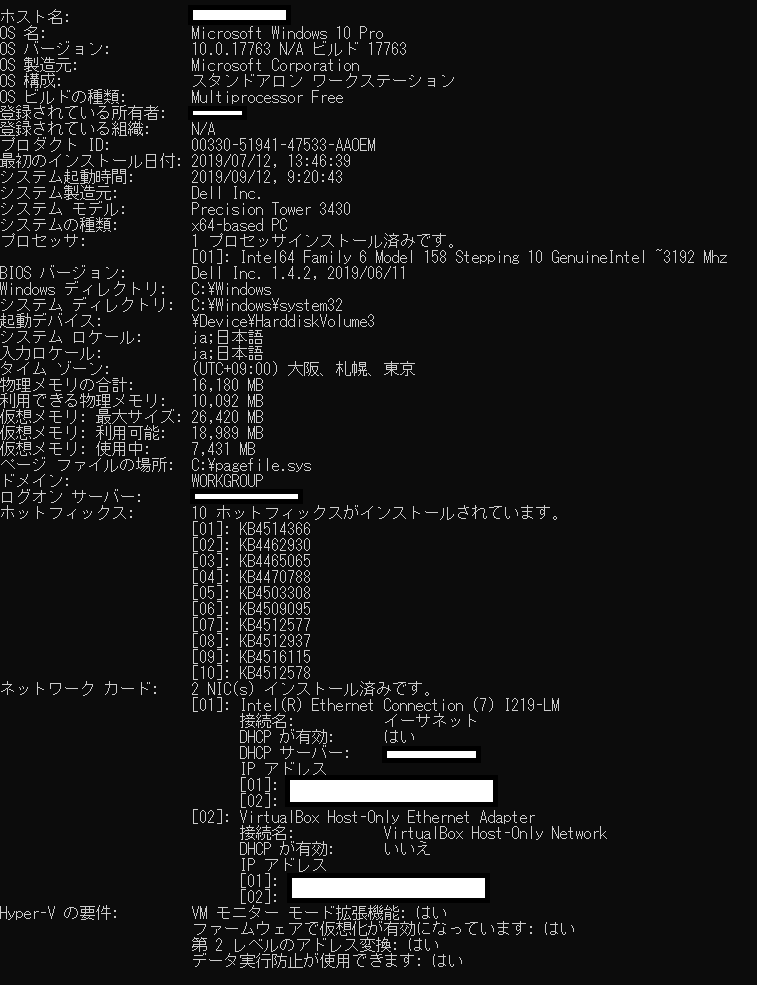

## systeminfoコマンドで確認出来る情報

- ホスト名
- OS 名
- OS バージョン
- OS 製造元
- OS 構成
- OS ビルドの種類
- 登録されている所有者
- 登録されている組織
- プロダクト ID
- 最初のインストール日付
- システム起動時間
- システム製造元
- システム モデル
- システムの種類
- プロセッサ
- BIOS バージョン
- Windows ディレクトリ
- システム ディレクトリ
- 起動デバイス
- システム ロケール
- 入力ロケール
- タイム ゾーン
- 物理メモリの合計
- 利用できる物理メモリ
- 仮想メモリ: 最大サイズ
- 仮想メモリ: 利用可能
- 仮想メモリ: 使用中
- ページ ファイルの場所
- ドメイン
- ログオン サーバー
- ホットフィックス　(適用されているホットフィックスを全て表示)
- ネットワークカード　(インストールされているNICをすべて表示)

